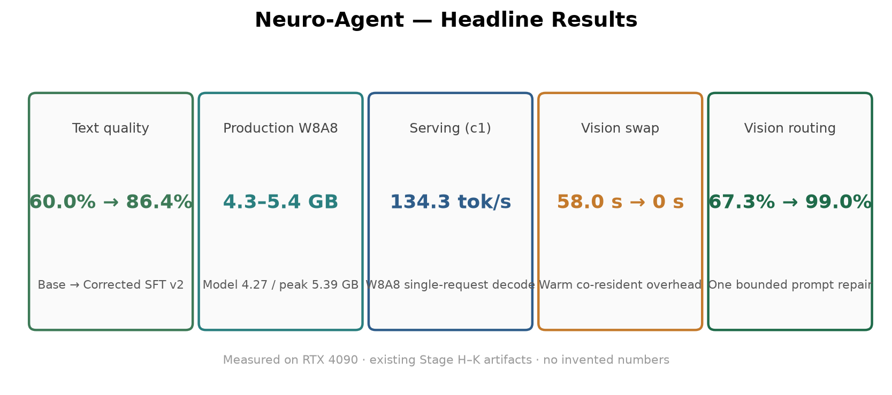
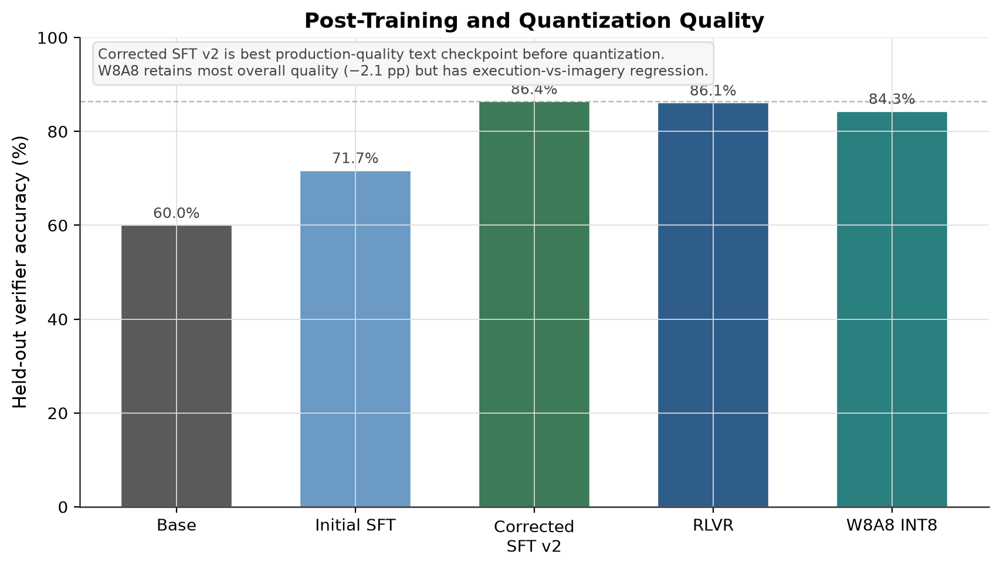
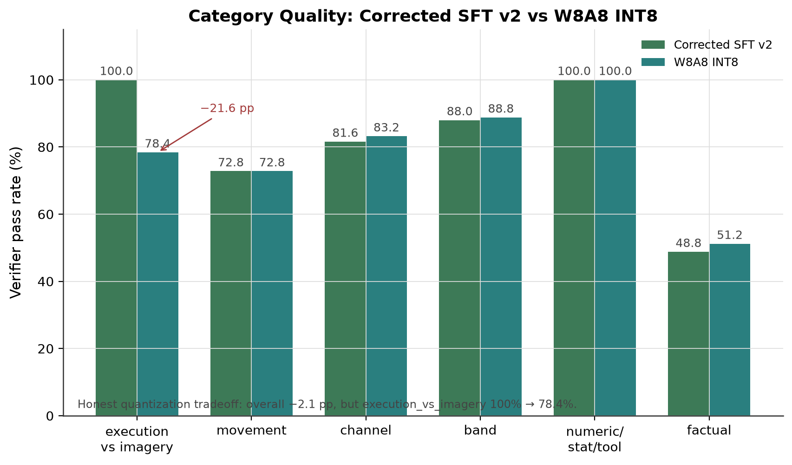
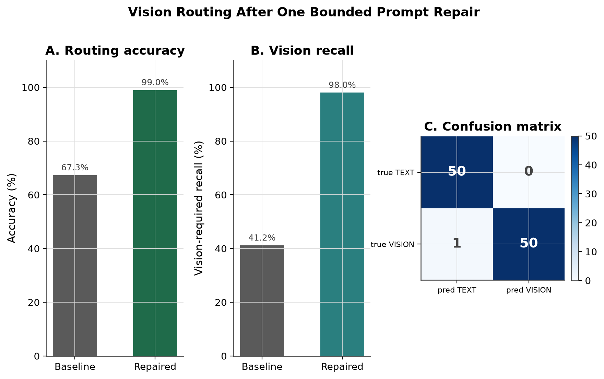
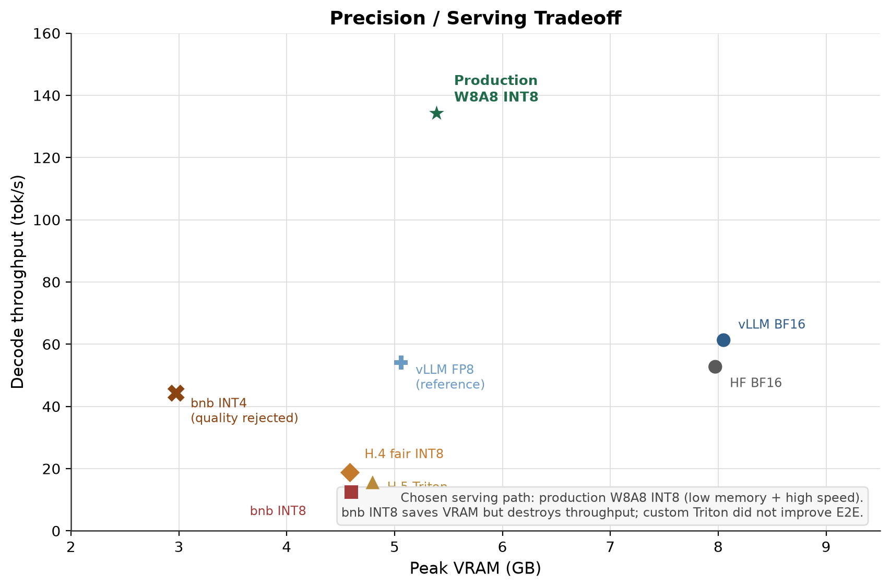
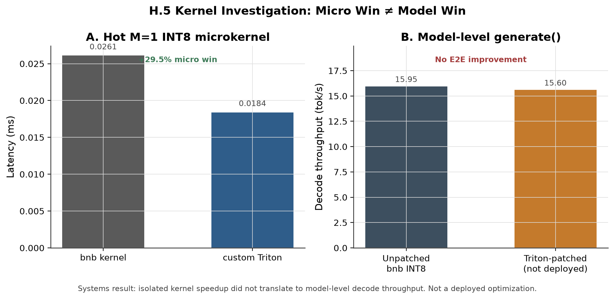
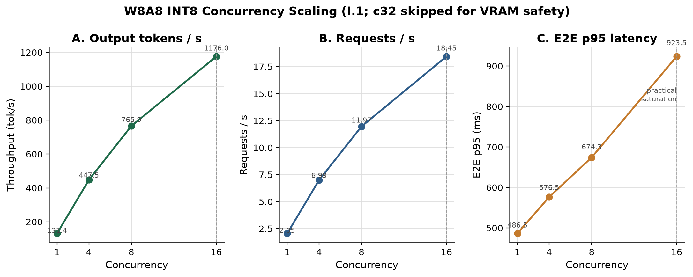
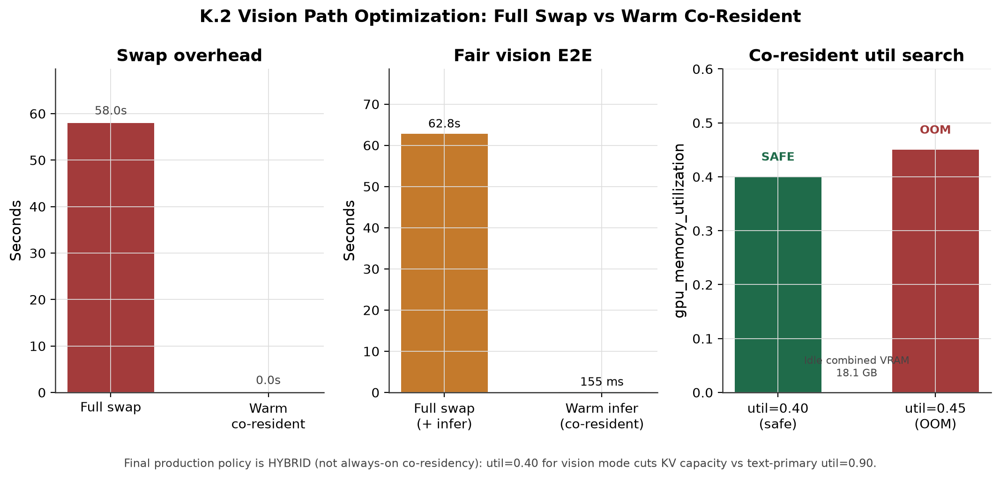

# Post-Training and Systems Optimization of a Multimodal Neuroscience Research Agent

A multimodal neuroscience research agent combining domain post-training, deterministic analysis tools, evidence grounding, verification/recovery, and optimized GPU inference.

---

## Why This Project

Scientific AI needs more than fluent text generation. Neuroscience workflows combine EEG time series, metadata, deterministic statistics, scientific visualizations, and natural-language research questions. Fluent language alone cannot guarantee exact numerics or visual fidelity.

This system separates three roles:

| Role | Responsibility |
|------|----------------|
| **Deterministic computation** | Exact numerical/scientific tools (band power, RMS, PSD peak, ranking, thresholds, condition comparison) |
| **Visual interpretation** | Vision-language model reasoning over plots (waveform, PSD, spectrogram, topomap) |
| **Model synthesis** | Language-model orchestration, grounding, and answer drafting |

This is a **research assistant**, not a diagnostic or clinical system.

---

## System Architecture

```
User
  → Next.js Research Workstation
  → FastAPI
  → Router

TEXT PATH (live API)                  VISION PATH (live API)
  → Qwen3-4B corrected SFT            → Qwen2.5-VL-3B corrected SFT
  → HF Transformers + LoRA (BF16)     → HF Transformers + PEFT (BF16)
  → deterministic tools               → figure interpretation

  → EvidenceBundle
  → grounded synthesis
  → conditional verifier (≤1 recovery)
  → structured answer
```

**Live product serving** uses HF Transformers + corrected LoRA/PEFT in BF16 (see `scripts/start_api_production.sh`, `src/neuro_agent/api/service.py`). Separate **W8A8 + vLLM** results below are systems benchmarks for the text stack—not what the live API loads today.
Routing decides whether a question needs visual interpretation (`requires_vision`) or can be answered with stored features and tools. On a 101-example routing eval (50 TEXT_ONLY / 51 VISION_REQUIRED), a single bounded prompt repair raised accuracy from **67.3% → 99.0%** and vision-required recall from **41.2% → 98.0%** (`results/routing/j1_summary.json`).

---

## Headline Results



| Metric | Value | Eval size / notes | Source |
|--------|------:|-------------------|--------|
| Text held-out quality (base → corrected SFT v2) | **60.0% → 86.4%** | n=1000 | `results/base_model_eval/`, `results/sft_corrected_v2_eval/` |
| Production W8A8 held-out quality | **84.3%** | n=1000 | `results/quantization/w8a8_int8/full_quality_eval.json` |
| Routing accuracy (final) | **99.0%** | n=101 | `results/routing/j1_summary.json` |
| Vision-required recall (final) | **98.0%** | 51 VISION_REQUIRED | `results/routing/j1_summary.json` |
| Single-request W8A8 decode | **134.3 tok/s** | offline `LLM.generate` | `results/quantization/w8a8_int8/single_request_benchmark.json` |
| Concurrency throughput (c=16) | **1176 tok/s** | prefix cache off | `results/model_comparison/w8a8_int8_concurrency_scaling.json` |
| Prefix-cache TTFT (warm vs off, c=1 p50) | **40.1 → 18.9 ms (−52.7%)** | prefill/TTFT, not decode | `results/model_comparison/w8a8_prefix_cache_comparison.json` |
| Vision swap overhead (mean) | **~58.0 s** | excludes VLM inference | `results/model_comparison/final_end_to_end_profile.json` |
| Agent unsupported numeric claims | **0** | primary n=16; recovery n=25 | `results/agent_primary_eval/`, `results/agent_recovery_eval/` |

Hardware for systems measurements: **NVIDIA GeForce RTX 4090 (24 GB)** (`results/hardware_verify.json`).

---

## Data

PhysioNet [EEG Motor Movement/Imagery Dataset](https://physionet.org/content/eegmmidb/1.0.0/) (subjects **S001–S030**, **14 runs** each).

| Artifact | Count |
|----------|------:|
| EDF recordings | 420 |
| Event files | 420 |
| Epochs (4.0 s windows) | 11,700 |
| Channels | 64 |
| Sampling rate | 160 Hz |

Subject-safe splits (`data/metadata/splits/split_report.json`):

| Split | Subjects | Epochs |
|-------|----------|-------:|
| Train | S001–S020 | 7,800 |
| Validation | S021–S025 | 1,950 |
| Held-out test | S026–S030 | 1,950 |

Tabular baselines use **576 features** (9 statistics × 64 channels) (`results/baseline_classifier/`). Visual assets cover waveform, PSD, spectrogram, and topomap views for multimodal questions.

---

## Text Post-Training

**Base model:** `Qwen/Qwen3-4B-Instruct-2507`

Story: Base → QLoRA SFT → corrective SFT → RLVR experiment.



| Checkpoint | Verifier pass rate | n |
|------------|-------------------:|--:|
| Base BF16 | 60.0% | 1000 |
| QLoRA SFT | 71.7% | 1000 |
| Corrective SFT v1 | 70.2% | 1000 |
| **Corrected SFT v2 (selected)** | **86.4%** | 1000 |
| RLVR | 86.1% | 1000 |

Corrected SFT v2 remained the selected quality checkpoint because RLVR did not improve the full held-out evaluation (`results/rlvr_model_eval/summary.json`).

---

## Quantized Quality Tradeoff

The **W8A8 + vLLM** text path is a systems benchmark on the merged corrected checkpoint (not the live FastAPI default, which serves HF Transformers + LoRA BF16). Overall held-out quality stays close to BF16 (**84.3% vs 86.4%**, n=1000), but one family regresses sharply:



| Family | Corrected BF16 | W8A8 | Δ | n |
|--------|---------------:|-----:|--:|--:|
| execution_vs_imagery | **100.0%** | **78.4%** | −21.6 pp | 125 |
| Overall (8 families) | 86.4% | 84.3% | −2.1 pp | 1000 |

Other families are flat or slightly up; invalid parse remains 0.0. This regression is treated as a known production caveat (see [What Did Not Work](#what-did-not-work)).

---

## Multimodal Post-Training

Qwen3 does not provide the vision-encoder path required here, so the stack uses two specialists:

- **Qwen3-4B** — text orchestration + tool routing
- **Qwen2.5-VL-3B** — visual interpretation, invoked only when routing requires vision

| VLM checkpoint | Pass rate | n |
|----------------|----------:|--:|
| Base | 11.4% | 440 |
| Multimodal SFT | 16.4% | 440 |
| **Corrected multimodal SFT (selected / production)** | **49.3%** | 440 |
| Multimodal RLVR | 48.2% | 440 |

Corrected multimodal SFT remains the production VLM checkpoint (`checkpoints/multimodal_sft_corrected/final`). Waveform-style vision is usable in live testing; **open-ended topomap and spectrogram interpretation is not reliable enough for research conclusions** (real V2/V3 gate failures). Later targeted patches raised aggregate held-out slightly but still failed those cases and were **rejected** (see [What Did Not Work](#what-did-not-work)).

Exact numerical scientific claims come from **deterministic tools**, not VLM visual estimation. Multimodal exact-numeric families remain limited (e.g. set/threshold and percent-difference tasks stay near zero on held-out corrected eval).


---

## Deterministic Research Tools

Six tools perform exact computation; the LLM orchestrates and synthesizes:

| Tool | Role |
|------|------|
| `compute_band_power` | Band-limited power |
| `compute_rms` | RMS amplitude |
| `find_psd_peak` | Peak frequency from PSD |
| `rank_channels` | Channel ranking by metric |
| `select_channels_above_threshold` | Threshold / set selection |
| `compare_conditions` | Condition comparison |

Unit tests: **21/21** in `tests/test_neuroscience_tools.py`.

Results are packaged as an **EvidenceBundle** with provenance (tool name, sample ids, units, numeric audit trail) so synthesis stays grounded.

---

## Agent + Verifier / Recovery

`PrimaryResearchAgent` pipeline:

intent → routing → tools → EvidenceBundle → grounded synthesis → **conditional verifier** → **max one recovery**

This is offline/eval-gated verification—not online self-learning.

| Metric | Primary agent | Verifier / recovery |
|--------|---------------:|----------------:|
| n | 16 | 25 |
| Intent schema validity | 100% | — |
| Tool execution success | 100% | — |
| Unsupported numeric claims | **0** | **0** |
| E2E success | 100% | 96% |
| Clean-path E2E | — | 100% |
| Recovery success (when attempted) | — | 100% (10/10) |
| Corruption recovery success | — | 72.7% |


---

## Routing

Baseline routing under-called vision (vision recall **41.2%**). One bounded `requires_vision` / routing-rule repair fixed the failure mode without expanding the eval set.

| | Baseline | Final |
|--|---------:|------:|
| Overall accuracy (n=101) | 67.3% | **99.0%** |
| Vision-required recall (51) | 41.2% | **98.0%** |
| Vision false negatives | 30 | **1** |
| Vision false positives | 3 | **0** |

Final confusion (expected × predicted): TEXT_ONLY 50/50 correct; VISION_REQUIRED 50/51 correct (1 FN).

Vision false negatives are treated as more serious than occasional unnecessary VLM invocation.



---

## Quantization Journey

```
HF BF16
  → bitsandbytes INT8 (HF Transformers + bnb)
  → INT4 experiment (quality gate failed)
  → profiling / runtime cleanup
  → Triton kernel investigation (rejected)
  → compressed-tensors W8A8 (SmoothQuant + GPTQ, INT8 weights, dynamic INT8 activations)
  → native vLLM CUTLASS INT8 serving
```

**Important distinction**

| Path | Stack |
|------|-------|
| bitsandbytes INT8 | Hugging Face Transformers + `bitsandbytes` `load_in_8bit` |
| Production W8A8 | `compressed-tensors` checkpoint + **vLLM** + `CutlassInt8ScaledMMLinearKernel` |

bnb INT8 was **not** served through vLLM.

| Path | Quality (n) | Decode tok/s | E2E ms | Model VRAM |
|------|------------:|-------------:|-------:|-----------:|
| HF BF16 | 86.4% (1000) | 52.74 | 1264.5 | ~7.9 GB |
| HF bnb INT8 | 86.6% (1000) | 12.5 | 5450 | ~4.5 GB |
| vLLM BF16 | smoke n=16 | 61.3 | 1043.8 | ~7.8 GB |
| **vLLM W8A8** | **84.3% (1000)** | **134.3** | **476.5** | **4.27 GB** |

vLLM BF16 used runtime LoRA; W8A8 is a merged checkpoint—throughput comparison is informative but not perfectly apples-to-apples.



---

## Kernel Investigation

A hot M=1 INT8 decode shape was profiled. A custom Triton microkernel improved the microbenchmark (**+29.5%** vs bitsandbytes on the primary decode M=1 case), but model-level decode did **not** improve (Triton-patched **15.6 tok/s** vs fair bitsandbytes baseline **18.73 tok/s**).

**Conclusion:** microkernel gains did not translate to end-to-end model throughput. The custom Triton kernel was **rejected for production**. Production W8A8 uses native Cutlass INT8 instead.



---

## Serving

Final text serving: **W8A8 vLLM** (`compressed-tensors`, Cutlass INT8), prefix cache off for the concurrency scaling study.

| Concurrency | Output tok/s | RPS | E2E p95 (ms) |
|------------:|-------------:|----:|-------------:|
| 1 | 131.4 | 2.05 | 486 |
| 4 | 447.5 | 6.99 | 577 |
| 8 | 765.9 | 11.97 | 674 |
| 16 | **1176.0** | 18.45 | 923 |
| 32 | — | — | **skipped** (VRAM safety near 24 GB) |



---

## Prefix Cache

Prefix caching improves **prefill / TTFT**, not decode speed.

| Condition (c=1) | TTFT p50 (ms) |
|-----------------|-------------:|
| Cache off | 40.1 |
| Cache on, warm | **18.9** (−52.7% vs off) |
| Cache on, true cold | 40.9 (≈ off) |

Decode throughput change at c=1 is small (+4.8% tok/s); gains come from reduced prefill/TTFT overlap.


---

## SLA / Admission Control

Selected SLA: **p95 E2E ≤ 1000 ms** for completed requests. With prefix cache on, completed-request p95 already stayed under budget with and without admission at offered concurrency 24/32.

Admission control (max active 16, queue 16, 500 ms timeout) provides **bounded overload**, queue control, and fail-fast rejection—not a free latency win:

| Offered | Admission | Rejection | Completed E2E p95 | SLA violations (completed) |
|--------:|:---------:|----------:|------------------:|---------------------------:|
| 24 | on | 33.3% | 680 ms | 0% |
| 32 | on | 50.0% | 742 ms | 0% |
| 24 | off | 0% | 704 ms | 0% |
| 32 | off | 0% | 707 ms | 0% |


---

## Final E2E Profiling

Text-path clean tool request ≈ **1.4 s** E2E (intent generation dominates). Vision-path latency is dominated by **model residency swapping**.

**Swap overhead** (excludes VLM inference): text unload + VLM load + VLM unload + text restore  
→ mean **~58.0 s** (`measured_swap_mean_ms = 58008.954`)

**Model work** (separate): image preprocessing + VLM generate (~4–5 s generate in swap-mode measurements).

The ~58 s figure **does not include** VLM inference time.


---

## Residency Optimization

| Config | Result |
|--------|--------|
| Text util **0.40** + warm VLM | Co-residency safe; swap overhead **0 ms**; warm vision E2E ≈ **0.16 s** |
| Text util **0.45** + VLM | **OOM** |
| Full swap (util 0.90 text-primary) | ~58 s swap overhead per vision request |

**Final policy: HYBRID**

- **Text-heavy mode** — text vLLM at higher KV reservation (util ≈ 0.90)
- **Vision-active mode** — reduced text reservation (util ≈ 0.40) + warm VLM

Reduced text reservation is not universally superior: it cuts KV capacity for text concurrency.



---

## FastAPI + Frontend

**Next.js research workstation** + **FastAPI** backend (`docs/api_contract.md`).

**Frontend:** Experiment panel, Neural Data Explorer, Research Agent, multi-image / selected visual context, text vs vision route display, analysis history, reset, evidence separation (computed vs visual), verifier/recovery timeline, system status.

**Backend endpoints:**

| Method | Path |
|--------|------|
| GET | `/api/health` |
| GET | `/api/system/metrics` |
| POST | `/api/upload` |
| POST | `/api/analyze` |
| GET | `/api/experiment/{id}` |
| GET | `/api/visualization/{id}` |

**Upload limits (honest):** figures as `.png`/`.jpg`/`.jpeg`/`.webp`; EEG/metadata as JSON referencing an existing processed `sample_id`. Raw EDF/CSV/NPY parsing is **not** implemented.

---

## Cost


Costs use the project RTX 4090 cloud rate **$0.74/GPU-hour** from `results/model_comparison/final_precision_cost_matrix.json` (single-request formulas; no batching).

| Path | USD / 1K requests | USD / 1M gen tokens | Notes |
|------|------------------:|--------------------:|-------|
| HF BF16 | 0.260 | 3.90 | measured matrix |
| HF bnb INT8 | 1.120 | 16.44 | measured matrix |
| vLLM BF16 | 0.215 | 3.35 | measured matrix (smoke quality) |
| **W8A8** | **~0.098** | **~1.53** | **DERIVED ESTIMATE** from cost formulas + measured e2e 476.5 ms / 134.3 tok/s |

W8A8 bars in the figure are labeled derived—not directly measured in the cost matrix artifact.

---

## What Did Not Work

Measured engineering decisions—not buried caveats:

| Result | Evidence |
|--------|----------|
| **Corrective SFT v1** regressed prior families (movement 73.6%→35.2%; execution_vs_imagery 29.6%→8.8%; overall 71.7%→70.2%, n=1000) | `results/sft_model_eval/`, `results/sft_corrected_eval/` |
| **RLVR** did not beat corrected SFT (86.1% vs 86.4%, n=1000) | `results/rlvr_model_eval/` |
| **Multimodal RLVR** did not beat corrected multimodal SFT (48.2% vs 49.3%, n=440) | `results/model_comparison/multimodal_base_vs_sft_vs_corrected_vs_rlvr.json` |
| **Topomap/spectrogram patch v1** improved aggregate held-out (→50.9%) but failed real V2/V3; rejected | `results/multimodal_topomap_spectrogram_patch_gate/` |
| **Vision reading V2** (audited synthetic scale-up) held waveform at 52.0% / overall 50.9% but still failed real V2/V3; rejected | `results/multimodal_vision_v2_training/` |
| **bnb INT8** saved VRAM but crushed throughput (12.5 vs 52.7 tok/s) | `results/model_comparison/final_precision_cost_matrix.json` |
| **INT4** failed the quality gate (`factual_grounding` 20% < 30% floor) | `results/quantization/text/quality/int4_targeted/gate_result.json` |
| **torch.compile** worsened decode (14.9 vs 18.7 tok/s) | `results/model_comparison/int8_before_vs_after_optimization.json` |
| **CUDA Graph** capture incompatible with bnb INT8 decode | `results/model_comparison/int8_before_vs_after_optimization.json` |
| **Triton kernel** won microbench (+29.5%) but lost model-level throughput | `results/model_comparison/int8_bnb_vs_triton_kernel.json` |
| **W8A8 calibration repair** failed; original W8A8 checkpoint kept | `results/quantization/w8a8_int8_quality_repair/decision.json` |
| **Co-residency at text util=0.45** OOM | `results/model_comparison/model_swap_vs_co_resident.json` |
| **NCU hardware counters** unavailable (`ERR_NVGPUCTRPERM`) | `results/profiling/ncu/` |
| **Production W8A8** kept strong overall quality (**84.3%**, n=1000) but introduced a major **execution_vs_imagery** regression vs corrected BF16: **100.0% → 78.4%** (n=125) | `results/quantization/w8a8_int8/full_quality_eval.json` |

---

## Final Architecture Summary

| Layer | Choice |
|-------|--------|
| Text (live API) | Qwen3-4B corrected SFT (`checkpoints/sft_corrected_v2/final`) via HF Transformers + LoRA, BF16 |
| Text (systems bench) | Merged corrected → W8A8 → vLLM Cutlass INT8 (benchmark path; not live API default) |
| Vision (live API) | Qwen2.5-VL-3B corrected SFT (`checkpoints/multimodal_sft_corrected/final`) via HF Transformers + PEFT, BF16 |
| Tools | Deterministic EEG / statistical analysis (6 tools) |
| Routing | 99.0% accuracy, 98.0% vision recall (n=101) |
| Verifier | Conditional; max one recovery |
| Serving | Hybrid residency (text-heavy vs vision-active) |
| Frontend | Next.js research workstation |
| Backend | FastAPI |
| Hardware | RTX 4090 24 GB |

---

## Additional Benchmarks

Secondary plots (primary figures are inlined above):

| Figure | Topic |
|--------|--------|
| [`04_cost_comparison`](docs/figures/04_cost_comparison.png) | Serving cost (W8A8 derived) |
| [`06_prefix_cache_impact`](docs/figures/06_prefix_cache_impact.png) | TTFT / prefix cache |
| [`07_sla_admission_control`](docs/figures/07_sla_admission_control.png) | Overload admission |
| [`09_vision_bottleneck_breakdown`](docs/figures/09_vision_bottleneck_breakdown.png) | Vision latency parts |
| [`12_agent_reliability`](docs/figures/12_agent_reliability.png) | Agent / recovery gates |
| [`13_multimodal_quality`](docs/figures/13_multimodal_quality.png) | VLM post-training |
| [`14_latency_distributions_boxplot`](docs/figures/14_latency_distributions_boxplot.png) | Per-request latency spreads |

Regenerate all figures from measured artifacts:

```bash
python scripts/generate_benchmark_figures.py
```

---

## Limitations

- Research use only—not medical diagnosis or clinical decision support
- Small domain models (4B text / 3B VLM)
- Factual QA weaker than tool-backed numerical tasks (corrected text factual_grounding 48.8%, n=125)
- W8A8 `execution_vs_imagery` regression (100% → 78.4%)
- Multimodal exact-numeric quality remains limited
- Vision-path concurrency not benchmarked at text-path scale
- Raw EEG API upload (EDF/CSV/NPY) not implemented
- Always-on public deployment not completed
- Mac-native inference is future work
- Some serving comparisons (e.g. vLLM BF16 LoRA vs merged W8A8) are not perfectly apples-to-apples

---

## Reproducibility

```bash
# Environment
bash scripts/setup_env.sh
# or: pip install -e . && pip install -e ".[hardware]"

# Hardware check
python scripts/verify_hardware.py

# Tool unit tests
python -m pytest -q tests/test_neuroscience_tools.py

# Benchmark figures (from existing results/**)
python scripts/generate_benchmark_figures.py

# FastAPI
PYTHONPATH=src .venv/bin/uvicorn neuro_agent.api.app:app --host 127.0.0.1 --port 8080

# Frontend
cd web && npm install && npm run dev
```

Checkpoints, upstream model weights, and raw EEG datasets are **not** included in this repository. Local `checkpoints/` artifacts (if present) come from project training/quantization runs and are not redistributed here.

---

## License and Model Attribution

- **Original repository code:** [Apache License 2.0](LICENSE)
- **Qwen3-4B-Instruct-2507:** Apache-2.0 (upstream model license)
- **Qwen2.5-VL-3B-Instruct:** Qwen Research License (upstream model license)

Model weights and derived checkpoints remain subject to their upstream licenses. This repository does not redistribute original Qwen weights. Users must comply with those terms when downloading or using the models.

EEG data: PhysioNet EEG Motor Movement/Imagery Dataset (Goldberger et al.).
